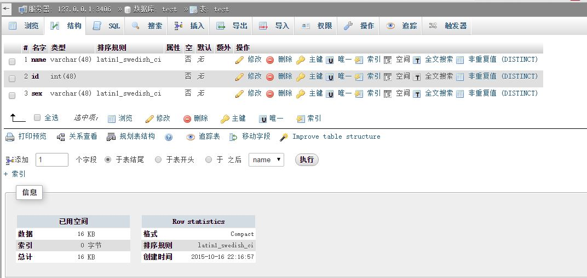
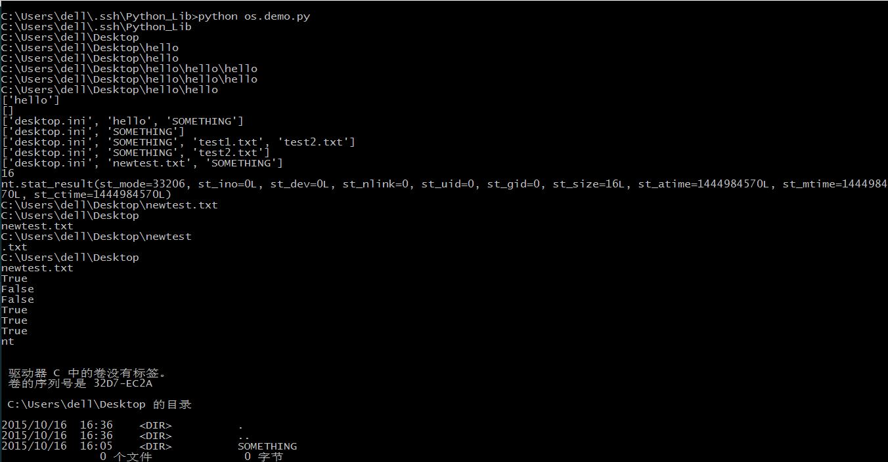
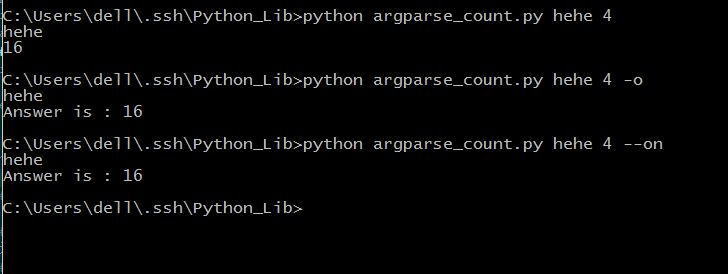

#python 库的学习
===
[TOC]

python的强大之处有很大的一方面在于它有各种各样非常强大的库，那么，这篇博客就是记录我学习各种的库的经历吧。
##MySQLdb
从名字就可以看出来，它的功能是与MySQL数据库连接用的
####基本使用
首先，让我们连接数据库。
```python
import MySQLdb

try:
	conn = MySQLdb.connect(host='localhost',user='root',passwd='',db='test',port=3406)
	print "Connect Successful !"
	conn.close()
except MySQLdb.Error,e:
     print "Mysql Error %d: %s" % (e.args[0], e.args[1])
```
保存为mysqldb_demo.py，运行，看一下结果。

可以看出来，如果MySQL数据库打开且账户密码正确的话就可以正确连接，并显示数据库版本，如果错误则报错并显示错误类型。

接下来，我们试一下数据库的增改删查和刷新。
先来看一下在数据库test中有一个表单test。
test中有三个选项，分别是name，id，sex，数据类型分别是char，int，char。

```python
#coding=utf-8
import MySQLdb

try:
	conn = MySQLdb.connect(host='localhost',user='root',passwd='',db='test',port=3406)
	print "Connect Successful !"
	cur = conn.cursor()
	cur.execute("SELECT * FROM test")
	data = cur.fetchone()
	print data
	value = ["Windard",001,"man"]
	cur.execute("INSERT INTO test(name,id,sex) VALUES(%s,%s,%s)",value)
	#注意一定要有conn.commit()这句来提交，要不然不能真正的插入数据。
	conn.commit()
	cur.execute("SELECT * FROM test")
	data = cur.fetchone()
	print data
	cur.close()
	conn.close()
except MySQLdb.Error,e:
     print "Mysql Error %d: %s" % (e.args[0], e.args[1])
```
保存为mysqldb_first.py,运行，看一下结果。

可以看到之前，在表单里并没有数据，在执行插入了之后有了一行数据。
注意，在执行插入之后一定要commmit()才能实行有效操作，不然不能写入数据库。
再来看一个完整的增改删查的代码。
```python
#coding=utf-8
import MySQLdb

try:
	conn = MySQLdb.connect(host='localhost',user='root',passwd='',db='test',port=3406)
	print "Connect Successful !"
	cur = conn.cursor()
	#首先查询原始数据库状态
	cur.execute("SELECT * FROM test ")
	data = cur.fetchone()
	print data
	#插入一条数据
	value = ["Windard",001,"man"]
	cur.execute("INSERT INTO test(name,id,sex) VALUES(%s,%s,%s)",value)
	conn.commit()
	#查询插入数据库之后的状态
	cur.execute("SELECT * FROM test ")
	data = cur.fetchone()
	print data	
	#更改数据库数据
	cur.execute("UPDATE test SET id = 100 WHERE name = 'Windard'")
	#查询更改数据之后的数据库数据
	cur.execute("SELECT * FROM test ")
	data = cur.fetchone()
	print data
	#删除数据库数据
	cur.execute("DELETE FROM test WHERE name = 'Windard'")
	#查询删除数据之后的数据库数据
	cur.execute("SELECT * FROM test ")
	data = cur.fetchone()
	print data	
	cur.close()		
	conn.close()
except MySQLdb.Error,e:
     print "Mysql Error %d: %s" % (e.args[0], e.args[1])
```
保存为mysqldb_second.py，运行，看一下结果。

这里包含完整的数据库增改删查的操作。

####进阶操作
那我们试一下创建一个新的数据库和新的表单，插入大量的数据来试试。
```python

```

##os
非常基础的一个库，但是却实现了我一个想了很久了功能，识别目录下的所有文件。

1. 取得当前目录--os.getcwd()
5. 更改当前目录——os.chdir()
2. 创建一个目录--os.mkdir()
3. 创建多级目录--os.makedirs()
4. 删除一个目录,只能删除空目录--os.rmdir("path")
5. 删除多个目录,删除目录及其下内容--os.removedirs（"path）
1. 获取目录中的文件及子目录的列表——os.listdir("path")		隐藏文件也会显示出来
3. 删除一个文件--os.remove()
4. 文件或者文件夹重命名--os.rename（old， new）
6. 获取文件大小--os.path.getsize（filename）
7. 获取文件属性--os.stat（file）
8. 修改文件权限与时间戳--os.chmod（file）
6. 将路径分解为目录名和文件名——os.path.split()
7. 获得路径的路径名--os.path.dirname()
8. 获得路径的文件名--os.path.basename()
9. 路径中加入新的内容--os.path.join(path,file)
7. 将目录分解为目录加文件名和文件名的扩展名——os.path.splitext()
8. 判断一个路径是否存在或是否为路径——os.path.isdir("path")
9. 判断一个文件是否存在或这否为文件——os.path.isfile("file")
10. 判断一个路径（目录或文件）是否存在——os.path.exists()
11. 判断一个路径是否是绝对路径--os.path.isabs()
9. 读取和设置环境变量--os.getenv() 与os.putenv()
10. 指示你正在使用的平台--os.name       对于Windows，它是'nt'，而对于Linux/Unix用户，它是'posix'
11. 给出当前平台使用的行终止符--os.linesep()    Windows使用'\r\n',Linux使用'\n',而Mac使用'\r'
12. 运行shell命令-- os.system()
13. 终止当前进程--os.exit（）

```python
#coding=utf-8
import os

currentpath = os.getcwd()
print currentpath
changedpath = 'C:\\Users\\dell\\Desktop' 
os.chdir(changedpath)
currentpath = os.getcwd()
print currentpath
os.mkdir('hello')
changedpath = changedpath + '\\hello'
print changedpath
os.chdir(changedpath)
currentpath = os.getcwd()
print currentpath
os.makedirs('hello\\hello')
changedpath = changedpath + '\\hello\\hello'
print changedpath
os.chdir(changedpath)
currentpath = os.getcwd()
print currentpath
os.chdir('../')
currentpath = os.getcwd()
print currentpath
currentlist = os.listdir(currentpath)
print currentlist
os.rmdir('hello')
currentlist = os.listdir(currentpath)
print currentlist
os.chdir('../../')
currentpath = os.getcwd()
currentlist = os.listdir(currentpath)
print currentlist
os.removedirs('hello\\hello')
currentlist = os.listdir(currentpath)
print currentlist
FILE1 = open('test1.txt','w')
FILE1.close()
FILE2 = open('test2.txt','w')
FILE2.close()
currentlist = os.listdir(currentpath)
print currentlist
os.remove('test1.txt')
currentlist = os.listdir(currentpath)
print currentlist
os.rename('test2.txt','newtest.txt')
currentlist = os.listdir(currentpath)
print currentlist
FILE = open('newtest.txt','w')
FILE.write('THis is for test')
FILE.close()
FILESIZE = os.path.getsize('newtest.txt')
print FILESIZE
FILESTAT = os.stat('newtest.txt')
print FILESTAT
currentpath = currentpath + "\\newtest.txt"
print currentpath
(splitpath,splitfile) = os.path.split(currentpath)
print splitpath
print splitfile
(splitpath,splitfile) = os.path.splitext(currentpath)
print splitpath
print splitfile
splitpath = os.path.dirname(currentpath)
splitfile = os.path.basename(currentpath)
print splitpath
print splitfile
isdir = os.path.isfile(currentpath)
isfile = os.path.isdir(currentpath)
print isdir
print isfile
os.remove('newtest.txt')
currentpath = os.path.dirname(currentpath)
isdir = os.path.isfile(currentpath)
isfile = os.path.isdir(currentpath)
print isdir
print isfile
isexist = os.path.exists(currentpath)
print isexist
isabs = os.path.isabs(currentpath)
print isabs
osname = os.name
print osname
linesep = os.linesep
print linesep
os.system('dir')
```
保存为os_improve.py

保存为os_demo.py，运行，看一下结果


给一个查看目录下的所有文件的代码，如果有目录则空格表示递进关系
```python
import os

def showall(path,leavel=0,filenum=0,show=True):
	newnum = filenum
	currentpath = path;
	dirandfile = os.listdir(path)
	for item in dirandfile:
		newpath = os.path.join(currentpath,item)
		if os.path.isdir(newpath):
			num = showall(newpath,leavel+1,newnum,show)
			newnum = num
		else:
			newnum = newnum + 1
			tab_stop = ""
			if show:
				for tab in range(leavel):
					tab_stop = tab_stop + " "
			print tab_stop + newpath

	return newnum

if __name__ == '__main__':
	num = showall('./',show=False)
	print "File Number : " + str(num)

```

##shutil
也是用来文件操作，但是它与os不同的是它只用来文件或文件夹操作
- shutil.copyfile('oldfile','newfile') 参数只能是文件，新文件不存在则创建
- shutil.copy("oldfile","newfileordir") olddir只能是文件，newfileordir可以是文件或文件夹
- shutil.copytree("olddir","newdir") 参数只能是目录，且newdir必须不存在
- shutil.move("oldpos","newpos") 移动文件或文件夹
- shutil.rmtree("dir") 可以空目录或者是有非空目录

##argparse
向python中传入命令行参数，解析命令行参数和选项。
####基本使用
```python
import argparse

parser = argparse.ArgumentParser()
parser.parse_args()
```
保存为argparse_demo.py，运行，看一下结果。

什么结果都没有，就是这样，它本来就什么都不做。
我们可以给它一个参数。'-h'或者'--help'

显示这个函数有一个可选参数'-h'或者'--help'，功能是显示帮助，然后退出。
```python
#coding=utf-8
#导入该模块
import argparse
#创建一个解析对象
parser = argparse.ArgumentParser()
#向该对象中添加你要关注的命令行参数和选项，每一个add_argument方法对应一个你要关注的参数或选项
parser.add_argument("echo")
#最后调用parse_args()方法进行解析,解析成功之后即可使用
args = parser.parse_args()
#回显参数
print args.echo

```
保存为argparse_add_argument.py，运行，看一下结果。
不过，现在我们增加了一个参数 'echo'

将输入的参数回显出来。
现在我们来看一下相应的参数
```python
ArgumentParser(prog=None, usage=None,description=None, epilog=None, parents=[],formatter_class=argparse.HelpFormatter, prefix_chars='-',fromfile_prefix_chars=None, argument_default=None,conflict_handler='error', add_help=True)

add_argument(name or flags...[, action][, nargs][, const][, default][, type][, choices][, required][, help][, metavar][, dest])
```
ArgumentParser()参数用的不多，一般只需要传递description参数。当调用parser.print_help()或者运行程序时由于参数不正确时，会打印这些描述信息。
add_argument()
name or flags：命令行参数名或者选项，如上面的address或者-p,--port.其中命令行参数如果没给定，且没有设置defualt，则出错。但是如果是选项的话，则设置为None
nargs：命令行参数的个数，一般使用通配符表示，其中，'?'表示只用一个，'*'表示0到多个，'+'表示至少一个
action：默认值
store:参数的存储格式化,默认为store。
type：参数的类型，默认是字符串string类型，还有float、int等类型
help：和ArgumentParser方法中的参数作用相似，出现的场合也一致
```python
#coding=utf-8
import argparse
parser = argparse.ArgumentParser(description="This is for test")
#这是必选参数
parser.add_argument("echo",help="echo this str")
#这也是必选参数，参数类型为int
parser.add_argument("int",help="count this int",type=int,action="store")
#这是可选参数，可以写长形式或短形式
parser.add_argument("-o","--on",help="show all",action="store_true")
args=parser.parse_args()
string = args.echo
print string
intchar = args.int
answer = intchar**2
#如果选择全部显示，则显示完整
if args.on:
	print "Answer is : " + str(answer)
else:
	print answer
```
保存为argparse_count.py，运行，看一下结果。

不带'-'的参数，调用时必须键入值，且顺序与程序定义的顺序一致。默认值
带'-'的参数，调用时可以不用输入。
####进阶操作

##sys
这个模块也可以传入命令行参数
####基本使用
####进阶操作

##文件的读写
####打开文件的方式
f.open('file'[,'mode'])

|模式		|描述				  			 |
|------  |----------------				|
|r		|以读方式打开文件，可读取文件信息。|
|w		|以写方式打开文件，可向文件写入信息。如文件存在，则清空该文件，再写入新内容；如果文件不存在则创建。|
|a	    |以追加模式打开文件（即一打开文件，文件指针自动移到文件末尾），如果文件不存在则创建。|
|r+ 	|以读写方式打开文件，可对文件进行读和写操作。|
|w+		|消除文件内容，然后以读写方式打开文件。|
|a+		|以读写方式打开文件，并把文件指针移到文件尾。|
|b		|以二进制模式打开文件，而不是以文本模式。该模式只对Windows或Dos有效，类Unix的文件是用二进制模式进行操作的。|

####打开文件的方法
|方法		|描述			|
|------	  |---------		|
|f.open() |打开文件				|
|f.close()|关闭文件				 |
|f.name() |获取文件名称		 |
|f.tell()|获得文件指针位置，标记当前位置，以文件开头为原点|
|f.read([size])|读出文件，size为读取的长度，以byte为单位|
|f.readline([size])|读出一行信息，若定义了size，则读出 一行的一部分|
|f.write(string)|把string字符串写入文件，write()不会在str后加上一个换行符。换行需加'\n'|
|f.writelines(list)|把list中的字符串一行一行地写入文件，是连续写入文件，没有换行。换行需加'\n'|
|f.next()|返回下一行，并将文件操作标记位移到下一行。把一个file用于for … in file这样的语句时，就是调用next()函数来实现遍历的。|
|f.readlines([size])|读出所有行，也就是读出整个文件的信息。(把文件每一行作为一个list的一个成员，并返回这个list。其实它的内部是通过循环调用readline()来实现的。如果提供size参数，size是表示读取内容的总长，也就是说可能只读到文件的一部分)|
|f.fileno()|获得文件描述符，是一个数字。返回一个长整型的”文件标签“|
|f.flush()|刷新输出缓存，把缓冲区的内容写入硬盘|
|f.isatty()|如果文件是一个终端设备文件（Linux系统中），则返回True，否则返回False。|
|f.seek(offset[,where])|把文件指针移动到相对于where的offset位置。where为0表示文件开始处，这是默认值 ；1表示当前位置；2表示文件结尾。(注意：如果文件以a或a+的模式打开，每次进行写操作时，文件操作标记会自动返回到文件末尾)|
|f.truncate([size])|把文件裁成规定的大小，默认的是裁到当前文件操作标记的位置。如果size比文件的大小还要大，依据系统的不同可能是不改变文件，也可能是用0把文件补到相应的大小，也可能是以一些随机的内容加上去。|


##参考链接
[python学习笔记（七）——文件和目录操作](http://www.cnblogs.com/zhoujie/archive/2013/04/10/python7.html)

[关于python文件操作](http://www.cnblogs.com/rollenholt/archive/2012/04/23/2466179.html)