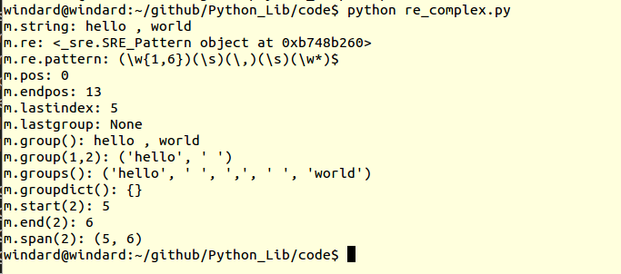

## re
这是python的正则表达式库，现在几乎所有的编程语言都支持正则表达式了，无可否认，正则表达式确实强大。

### 正则表达式基本语法

与其他编程语言的正则表达式基本类似。

|特殊字符|匹配说明|
|--          |---         |
|`\`          |转义字符  |
|`\d`         |单个数字 [0-9] |
|`\D`         |单个非数字 |
|`\s`          |单个空白字符`[<空格>\t\n\r\f\v`]|
|`\S`          |单个非空白字符 |
|`\w`         |单个单词字符[a-zA-Z0-9]|
|`\W`        |单个非单词字符`[^\w]`|
|`\A`         |匹配字符串的开头|
|`\Z`         |匹配字符串的结尾|
|`\b`         |匹配仅在开头或结尾的空字符|
|`\B`         |匹配不在开头或结尾的空字符|
|`\\`          |匹配字符`\`|
|`.`           |匹配除换行符`\n`之外的任意字符|
|`*`           |匹配前一个字符零次到无限次|
|`+`          |匹配前一个字符一次到无限次|
|`？`         |匹配前一个字符零次或一次   |
|`{m}`       |匹配前一个字符m次|
|`{m,n}`   |匹配前一个字符m次到n次|
|`^`         |匹配字符串的开头，也可以在一个字符集内表示取非|
|`$`          |匹配字符串的结尾|
|`[……]`        |表示一个字符集|
|`(……)`   |表示一个分组|


### 基本使用

python提供了两种不同的基本正则匹配，分别是match和search。

match是从字符串开头做匹配，search是从字符串中做任意匹配，返回值都是一个Match实例,他们的用法基本一致，`match(pattern, string, flags=0)`和`search(pattern, string, flags=0)`。

在python里面为了避免反斜杠`\`的困扰，一般都使用原生字符串，即使用`r'XXX'`

```

>>> a = re.match(r"he","hello , world")
>>> a
<_sre.SRE_Match object at 0xb70afdb0>
>>> a.group()
'he'
>>> b = re.search(r"wo","hello , world")
>>> b
<_sre.SRE_Match object at 0xb70afdb0>
>>> b.group()
'wo'
>>> c = re.match(r"wo","hello , world")
>>> c
>>> type(c)
<type 'NoneType'>
>>> re.match(r'(hello) , (world)', a).group(0)
'hello , world'
```

但是这种匹配一般只能找到匹配的一个，有时我们需要找到所有的匹配，这就需要findall函数，用法也与上面的两个一样`findall(pattern, string, flags=0)`,直接返回一个数组，数组的每一项都是字符串。

```

>>> d = re.findall(r"wo","hello , world")
>>> d
['wo']
>>> e = re.findall(r"\w","hello , world")
>>> e
['h', 'e', 'l', 'l', 'o', 'w', 'o', 'r', 'l', 'd']
>>> re.findall(r"\d+", "2333abc3uio890da123")
['2333', '3', '890', '123']
```

除了查找之外，正则表达式还有两个很重要的功能就是分割与替换，在这里分别是sub和split，用法是`sub(pattern, repl, string, count=0, flags=0)`和`split(pattern, string, maxsplit=0, flags=0)`,返回改变之后的字符串，传入值保持不变。

> repl 即可以为一个字符串，也可以为一个可执行函数

```

>>> a = "hello , world"
>>> b = re.sub(r"o","0","hello , world")
>>> b
'hell0 , w0rld'
>>> a
'hello , world'
>>> c = re.split(r"\s","hello , world")
>>> c
['hello', ',', 'world']
>>> a
'hello , world'
>>> re.sub(r'(hello) , (world)', r'\2 , \1', a)
'world , hello'
>>> '%s , %s' % re.match(r'(hello) , (world)', a).groups()
'hello , world'
>>> '%s , %s' % (re.match(r'(hello) , (world)', a).group(2), re.match(r'(hello) , (world)', a).group(1))
'world , hello'
>>> re.search(r"(.+?)\1+", 'dxabcabcyyyydxycxcxz').group()
'abcabc'
```

关于sub函数，还有一个subn函数，用法与sub一致，但是返回一个元组，由改变之后的字符串和改变的个数组成

```

>>> b = re.subn(r"o","0","hello , world")
>>> b
('hell0 , w0rld', 2)
>>> a
'hello , world'
```

### 后向引用

同时，也可以用在搜索查找的时候。

在找到连续的重复字符, `\1` 可以用来指代已经匹配到的第一个分组
> **需注意，引用分组的匹配值必须与第一个分组匹配值相等才能匹配到，如果只是规则相同但是匹配值不同是匹配不到的**

```
In [4]: re.search(r"(.+?)\1+", 'dxabcabcyyyydxycxcxz').group()
Out[4]: 'abcabc'

In [5]: re.search(r"(.+?)\1+", 'dxabcabcyyyydxycxcxz').groups()
Out[5]: ('abc',)
```

在 sublime 中做替换时，可以使用 `$1` 表示匹配到的第一个分组，使用 `$2` 表示匹配到的第二个分组，这样可以用来做数据替换和提取。

在 python 中同理，使用 `\1` 表示匹配到的第一个分组，使用 `\2` 表示匹配到的第二个分组，使用 `\0` 表示被匹配到的字符串本身。

- 使用 match 从头开始匹配，使用 search 从中匹配
- 使用 group 查看全部匹配结果，使用 groups 查看匹配分组结果, 使用 groupdict 根据分组命名查看匹配结果。

查找 abb 型数据

```
>>> re.compile(r'(a)(b)\2*').search('abbbb').groups()
('a', 'b')
>>> re.compile(r'(a)(b)\2*').search('abbbb').group()
'abbbb'
```

### 高级使用
高级使用是先将正则表达式的字符串形式编译成Pattern实例，然后用Pattern实例处理字符串并得到一个Match实例，再对这个Match实例进行处理。

```
# coding=utf-8

import re

pattern = re.compile(r"he")

match = pattern.match("hello , world")

if match:
    print match.group()

```

保存为re_demo.py，执行，看一下结果。    


compile函数`compile(pattern, flags=0)`，这里的参数flags和上面的函数里的flags都是匹配模式，可以使用`|`表示同时生效，可选的参数有：
1. `re.I(re.IGNORECASE)`: 忽略大小写  
2. `re.M(re.MULTILINE)`: 多行模式，改变'^'和'\$'的行为  
3. `re.S(re.DOTALL)`: 点任意匹配模式，改变'.'的行为  
4. `re.L(re.LOCALE)`: 使预定字符类` \w \W \b \B \s \S `取决于当前区域设定  
5. `re.U(re.UNICODE)`: 使预定字符类` \w \W \b \B \s \S \d \D `取决于unicode定义的字符属性  
6. `re.X(re.VERBOSE)`: 详细模式。这个模式下正则表达式可以是多行，忽略空白字符，并可以加入注释  

Match对象 是一次匹配的结果，包含很多关于此次匹配的信息

属性：  
1. `string`: 匹配时传入的文本
2. `re`: 匹配时使用的Pattern对象
3. `pos`: 文本中正则表达式开始搜索的索引。
4. `endpos`: 文本中正则表达式结束搜索的索引。
5. `lastindex`: 最后一个被捕获的分组在文本中的索引。如果没有被捕获的分组，将为None
6. `lastgroup`: 最后一个被捕获的分组的别名。如果这个分组没有别名或者没有被捕获的分组，将为None

方法：  
1. `group([group1, …])`: 获得一个或多个分组截获的字符串；指定多个参数时将以元组形式返回。group1可以使用编号也可以使用别名；编号0代表整个匹配的子串；不填写参数时，返回group(0),相当于全部返回；没有截获字符串的组返回None；截获了多次的组返回最后一次截获的子串
2. `groups([default])`: 以元组形式返回全部分组截获的字符串。相当于调用group(1,2,…last)。default表示没有截获字符串的组以这个值替代，默认为None
3. `groupdict([default])`: 返回以有别名的组的别名为键、以该组截获的子串为值的字典，没有别名的组不包含在内。default含义同上
4. `start([group])`: 返回指定的组截获的子串在string中的起始索引（子串第一个字符的索引）。group默认值为0
5. `end([group])`: 返回指定的组截获的子串在string中的结束索引（子串最后一个字符的索引+1）。group默认值为0
6. `span([group])`: 返回(start(group), end(group))
7. `expand(template)`: 将匹配到的分组代入template中然后返回。template中可以使用`\id`或`\g<id>`、`\g<name>`引用分组，但不能使用编号0。`\id`与`\g<id>`是等价的；但`\10`将被认为是第10个分组，如果你想表达`\1`之后是字符`'0'`，只能使用`\g<1>0`

```python
# coding=utf-8

import re

pattern = re.compile(r"(\w{1,6})(\s)(\,)(\s)(\w*)$")
m = re.match(pattern,"hello , world")

print "m.string:", m.string
print "m.re:", m.re
print "m.re.pattern:", m.re.pattern
print "m.pos:", m.pos
print "m.endpos:", m.endpos
print "m.lastindex:", m.lastindex
print "m.lastgroup:", m.lastgroup

print "m.group():", m.group()
print "m.group(1,2):", m.group(1, 2)
print "m.groups():", m.groups()
print "m.groupdict():", m.groupdict()
print "m.start(2):", m.start(2)
print "m.end(2):", m.end(2)
print "m.span(2):", m.span(2)

```

保存为re_complex.py，运行，看一下结果。



### 贪婪与懒惰

正则表达式默认是贪婪模式，即匹配尽可能多的字符，如 `+` 匹配一个到无穷多个，就匹配尽可能多的到不匹配为止，如果采用懒惰模式，则就刚好匹配一个，不再多了。

|代码 / 语法 |匹配说明|
|--          |---         |
|`*?`          |重复任意次，但尽可能的少重复            |
|`+?`          |重复1次或更多次，但尽可能少重复            |
|`??`          |重复0次或1次，但尽可能少重复            |
|`{n, m}?`     |重复n到m次，但尽可能少重复            |
|`{n,}?`       |重复n次以上，但尽可能少重复            |

```
import re

m = re.match(r'<html>(.*)', "<html><body><title>this is title</title></body></html>>")

print m.group()

m = re.match(r'<html>(.*?)', "<html><body><title>this is title</title></body></html>>")

print m.group()

```

输出

```
<html><body><title>this is title</title></body></html>>
<html>
```

## 分组于捕获

|代码 / 语法 		|匹配说明|
|--         		 |---         |
|`(?:)`        		 | 只做匹配分组，不做结果展示，否则会有很多无用的分组结果           |
|`(?P<name>)`          | 对分组结果结果命令，使用命名获取	    |
|`(?P=<name>)`      | 在后向引用时使用前面匹配到的分组名|

```
In [1]: import re

In [2]: re.match(r"(?P<key>\w+):(?P<value>\d+)", "haha:1").groups()
Out[2]: ('haha', '1')

In [3]: re.match(r"(?P<key>\w+):(?P<value>\d+)", "haha:1").groupdict()
Out[3]: {'key': 'haha', 'value': '1'}

In [4]: re.search(r"((?P<key>\w+):(?P<value>\d+);)*", "haha:1;laal:2;").groups()
Out[4]: ('laal:2;', 'laal', '2')

In [5]: re.search(r"((?P<key>\w+):(?P<value>\d+);)*", "haha:1;laal:2;").groupdict()
Out[5]: {'key': 'laal', 'value': '2'}

In [6]: re.search(r"(?:(?P<key>\w+):(?P<value>\d+);)*", "haha:1;laal:2;").groups()
Out[6]: ('laal', '2')
```

但是有个问题就是匹配到的子串，只会出现一次，不能返回重复的结果，只会返回最终匹配的结果，需要使用 regex 来得到所有的匹配结果。

### 常用正则

对于常见的nginx日志配置格式

```
    log_format  main  '$remote_addr - $remote_user [$time_local] "$request" '
                      '$status $body_bytes_sent "$http_referer" '
                      '"$http_user_agent" "$http_x_forwarded_for"';
```

使用正则匹配规则就很简单

```python
obj = re.compile(r'(?P<ip>.*?)- - \[(?P<time>.*?)\] "(?P<request>.*?)" (?P<status>.*?) (?P<bytes>.*?) "(?P<referer>.*?)" "(?P<ua>.*?)" "(?P<forwarded>.*?)"')

```

驼峰转下划线

```
# -*- coding: utf-8 -*-

import re


def convert_camel_to_snake(hump_str):
    """
    驼峰形式字符串转成下划线形式
    :param hump_str: 驼峰形式字符串
    :return: 字母全小写的下划线形式字符串
    """
    # 匹配正则，匹配小写字母和大写字母的分界位置
    p = re.compile(r'([a-z]|\d)([A-Z])')
    # 这里第二个参数使用了正则分组的后向引用
    sub = re.sub(p, r'\1_\2', hump_str).lower()
    return sub


if __name__ == '__main__':
    print(convert_camel_to_snake("AdId"))
    print(convert_camel_to_snake("CampaignId"))
    print(convert_camel_to_snake("coreUserID"))
    print(convert_camel_to_snake("FromWhereYouGo"))
    print(convert_camel_to_snake("PackageId"))
    print(convert_camel_to_snake("SocketServer"))
    print(convert_camel_to_snake("Python_Lib"))

```

## 参考链接

[正则表达式30分钟入门教程](http://deerchao.net/tutorials/regex/regex.htm)
