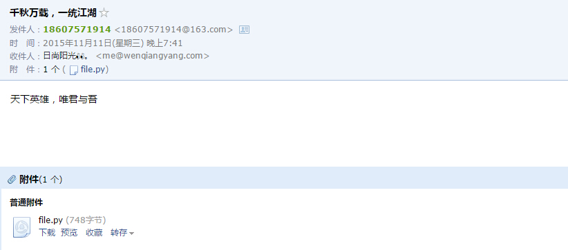

## smtplib

用Python发送邮件，胶水语言当然能够胜任。通过SMTP协议发送邮件，不过它并不是自己的邮件服务器，而是通过调用你的邮箱给别人发送邮件，比如说QQ邮箱或者网易邮箱或者什么什么的。      
先来一个简单的示例。     
>不过想要使用你的邮箱通过SMTP发送邮件需要先确认你的邮箱服务器开通了SMTP服务。    
>以QQ邮箱为例，开通SMTP服务这样的。     
>

#### 基本使用

```python
#coding=utf-8

import smtplib

#先创建一个连接邮件服务器对象，使用默认端口25
smtpObj = smtplib.SMTP("smtp.qq.com")

#用户名和密码登陆
from_name = '1106911190@qq.com'
to_name = 'me@wenqiangyang.com'

#如果此处用的是QQ邮箱，那么这个密码就是你的QQ邮箱独立密码
password = 'XXXXXX'

#以下为邮件的内容,发送的内容是字符串。
#但是邮件一般由标题，发件人，收件人，邮件内容，附件构成。
#发送邮件的时候需要使用SMTP协议中定义的格式
message = """
From: From Person <1106911190@qq.com>
To: To Person <me@wenqiangyang.com>
Subject: SMTP e-mail test

This is a test.
"""

#登陆邮箱
smtpObj.login(from_name,password)

#发送邮件
smtpObj.sendmail(from_name,to_name,message)

print "Sending Successful"

#关闭连接
smtpObj.close()
```

保存为qqmail_smtp_demo.py，运行，看一下结果。    

         

这样就可以发送一个简单的邮件了，其实真正核心的代码只有四行。    

1. smtplib.SMTP( [host [, port [, local_hostname]]] )     
这句代码用来创建一个SMTP对象，并连接邮件服务器。     
>在此处，也可以化为两步。
>先创建对象`smtpObj = smtplib.SMTP()`，再连接服务器 `smtpObj.connect(host)`
2. SMTP.login(user,password)     
用上一句创建的SMTP对象，登陆发邮件的邮箱     
3. SMTP.sendmail(from_addr, to_addrs, msg[, mail_options, rcpt_options]     
还是用SMTP对象发出邮件，不过要注意一下第三个参数msg，一般不自己写，而是通过MIME来创建一个msg对象再转化为字符串。就像上面的这个例子，我自己写msg并没有效果，被全部当成了邮件正文发送。     
4. SMTP.close()     
关闭SMTP对象的连接，其实如果你不关闭，在代码运行结束也会被自动关闭。      

接下来，我们使用163邮箱也来试一下。   

```python
#coding=utf-8

import smtplib
from email.mime.text import MIMEText

smtpObj = smtplib.SMTP("smtp.163.com")
from_name = '18607571914@163.com'
to_name = 'me@wenqiangyang.com'
password = 'XXXXXX'

#使用MIMEText来创建msg对象
message = MIMEText("天下武功，唯快不破")
message["Subject"] = "千秋万载，一统江湖"
message["From"] = from_name
message["To"] = to_name

smtpObj.login(from_name,password)
#这个地方需要把message对象转化为字符串
smtpObj.sendmail(from_name,to_name,message.as_string())
print "Sending Successful"
smtpObj.close()
```

保存为163mail_smtp_demo.py，运行，看一下结果。    

     

#### 进阶操作

##### 发送HTML格式的邮件   
其实发送HTML格式的邮件也非常简单，在MIMETest对象里面指定文本为HTML即可。   

```python
#coding=utf-8

import smtplib
from email.mime.text import MIMEText

smtpObj = smtplib.SMTP("smtp.163.com")
from_name = '18607571914@163.com'
to_name = 'me@wenqiangyang.com'
password = 'XXXXXX'

#这是将要发送的HTML部分
HTML = "<p>天下武功，唯快不破<p><br><a href='http://www.wenqiangyang.com'>Click To Find Me</a>"

#只需在MIMETest对象里指定文件格式
message = MIMEText(HTML,_subtype='html',_charset='utf-8')
message["Subject"] = "千秋万载，一统江湖"
message["From"] = from_name
message["To"] = to_name

smtpObj.login(from_name,password)

#这个地方需要把message对象转化为字符串
smtpObj.sendmail(from_name,to_name,message.as_string())
print "Sending Successful"
smtpObj.close()
```

保存为163mail_smtp_html.py，运行，看一下结果。   

   

   

##### 在邮件中显示图片
发送图片并在邮件正文中显示出来，需要用到 email 的 MIMEImage 实例，并选用 HTML 格式的正文。

```python
#coding=utf-8

import smtplib
from email.mime.text import MIMEText
from email.mime.image import MIMEImage
from email.mime.multipart import MIMEMultipart

smtpObj = smtplib.SMTP("smtp.163.com")
from_name = '18607571914@163.com'
to_name = '1106911190@qq.com'
password = 'XXXXXX'

# 先创建一个带附件的对象
message = MIMEMultipart()

# 构造图像
image = MIMEImage(open('puzzle.jpg','rb').read())
image.add_header('Content-ID','<imagename>')

# 将图像加入邮件中
message.attach(image)

# 在邮件中加入内容
content = MIMEText("这是一封带有图有真相的邮件<br />","html","utf-8")
message.attach(content)

# 邮件的收件人，发件人及主题
message["Subject"] = "千秋万载，一统江湖"
message["From"] = from_name
message["To"] = to_name

smtpObj.login(from_name,password)
# 这个地方需要把message对象转化为字符串
smtpObj.sendmail(from_name,to_name,message.as_string())
print "Sending Successful"
smtpObj.close()
```


保存为163mail_smtp_image.py，运行，看一下结果。   

    

##### 发送附件
发送附件则需要创建 MIMEMultipart 实例，然后构造附件发送。    

```python
#coding=utf-8

import smtplib
from email.mime.text import MIMEText
from email.mime.multipart import MIMEMultipart

smtpObj = smtplib.SMTP("smtp.163.com")
from_name = '18607571914@163.com'
to_name = 'me@wenqiangyang.com'
password = 'XXXXXX'

#先创建一个带附件的对象
message = MIMEMultipart()

#构造附件
attr = MIMEText(open("163mail_smtp_html.py","rb").read(),"base64","utf-8")
attr["Content-Type"] = 'application/octet-stream'
#此处的文件名写什么，邮件中显示什么名字
attr["Content-Disposition"] = 'attachment; filename="file.py"'

#将附件加入邮件中
message.attach(attr)

#在邮件中加入内容
content = MIMEText("天下英雄，唯君与吾","plain","utf-8")
message.attach(content)

#邮件的收件人，发件人及主题
message["Subject"] = "千秋万载，一统江湖"
message["From"] = from_name
message["To"] = to_name

smtpObj.login(from_name,password)
#这个地方需要把message对象转化为字符串
smtpObj.sendmail(from_name,to_name,message.as_string())
print "Sending Successful"
smtpObj.close()
```

保存为163mail_smtp_multipart.py，运行，看一下结果。   

    

   

如果需要发送多个附件则依次创建附件对象并加入邮件即可。    

##### SSL与TLS
python支持SSL/TLS的安全邮件。       
使用`smtpObj.starttls()`即可开启ssl，就像这样。     

```python
#coding=utf-8

import smtplib
import socket

#先创建一个连接邮件服务器对象，使用默认端口25
smtpObj = smtplib.SMTP("smtp.qq.com")
try:
	smtpObj.starttls()
	print "Successful SSL"
except:
	pass
#用户名和密码登陆
from_name = '1106911190@qq.com'
to_name = 'me@wenqiangyang.com'
#如果此处用的是QQ邮箱，那么这个密码就是你的QQ邮箱独立密码
password = 'XXXXXX'
#以下为邮件的内容,发送的内容是字符串。
#但是邮件一般由标题，发件人，收件人，邮件内容，附件构成。
#发送邮件的时候需要使用SMTP协议中定义的格式
message = """
From: From Person <1106911190@qq.com>
To: To Person <me@wenqiangyang.com>
Subject: SMTP e-mail test

日出东方，唯我不败
"""

#登陆邮箱
smtpObj.login(from_name,password)
#发送邮件
smtpObj.sendmail(from_name,to_name,message)
print "Sending Successful"
#关闭连接
smtpObj.close()
```
保存为smtp_ssl.py，保存，运行看一下结果。      
    