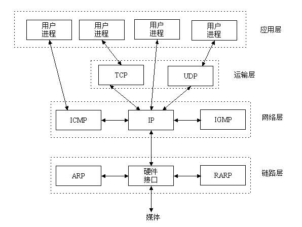
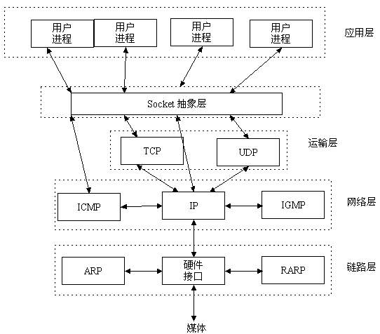
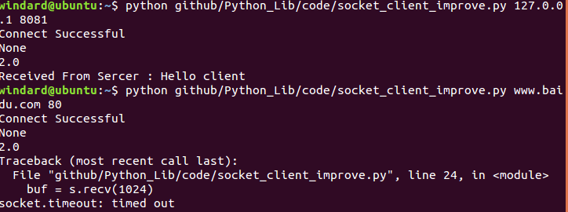
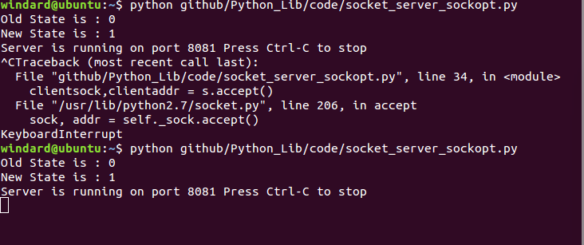

## socket

socket网络编程，我其实一直是拒绝讲这个的，因为这个socket涉及到的知识面之广，我怕我个人也难以解释清楚。

socket是一种基于TCP/IP协议的，在传输层与应用层之间进行信息交流的网络通信方式，它主要用于在同一台主机或不同的主机的进程之间的通信。

TCP/IP协议是一套使用使用广泛的通信协议的合集。

正如在全中国推行普通话一样，通信协议就是通信标准，不同的语言或者信息在同样的标准下可以相互传输并正常交流，这就是通信协议的功能。

在这里我们就不再深入的研究TCP/IP协议，它包括很多的内容，具体的可以看一下：
《TCP/IP协议详解》

[协议森林](http://www.cnblogs.com/vamei/archive/2012/12/05/2802811.html)

这是一张TCP/IP参考模型图。



可以看到图中除了TCP协议还有UDP协议。
TCP协议需要经过三次握手才能建立持久稳定的连接，而UDP协议只管收发信息，并不会管是否接受。
TCP协议是持久的，有效的，可靠的。
UDP协议是快速的，简单的，少量的。
socket对TCP和UDP都支持。

那么接下来让我们看一下socket在哪里呢。



socket抽象层是在TCP与UDP协议的运输层之上的与应用层连接的抽象层，也就是说socket能够通过使用TCP协议或者UDP协议来实现很多相关的应用性协议功能的，比如说http，https，FTP，smtp，DNS等。

因为socket起源于Unix，Unix/Linux的基本原则之一就是`一切皆文件`，都可以用`打开(open )-->读写(read/write)-->关闭(close)`模式来进行操作。

所以socket的使用是非常简单的，如下图所示。


网络通信之间都是至少需要一个服务器端和一个客户端的，我们的socket就先从简单的客户端开始。

#### 简单的TCP协议的网络客户端

```python

import socket,sys

host = sys.argv[1]
port = int(sys.argv[2])

s = socket.socket(socket.AF_INET,socket.SOCK_STREAM)
try:
    s.connect((host,port))
    print "Connect Successful"
except:
    print "Connect Failed"

s.send("hello server")

buf = s.recv(1024)
print "Received From Sercer : " + buf
```

保存为socket_client.py，运行，看一下结果。


可以看到，我先是在本机开了一个ftp服务器，用socket可以成功连接上去，然后就是连接百度的http服务器，看到也连接成功了，最后一个是连接后面的socket服务器，同样的返回了服务器的回复。可是为什么百度的http服务器没有回复呢？因为我们向它发送的请求不对,如果想要得到返回数据，我们需要发送一个GET请求,`GET / HTTP/1.1\r\n\r\n`。

#### 简单的TCP协议的网络服务器

```python

import socket

host = "127.0.0.1"
port = 8081

s = socket.socket(socket.AF_INET,socket.SOCK_STREAM)
s.bind((host,port))
s.listen(5)

print "Server is running on port %s Press Ctrl-C to stop"%port

while 1:
    clientsock,clientaddr = s.accept()
    print "Welcome from %s : %s"%(clientaddr[0],clientaddr[1])
    resquest = clientsock.recv(1024)
    print "Received From client : " + resquest
    clientsock.send("Hello client")
    clientsock.close()

s.close()
```

保存为socket_server.py，运行，看一下结果。


以上就是我们的socket的一个简单的使用了，接下来我们详细的讲解一下socket客户端和服务器端的相应的功能。

> 在 Windows 下无法使用 Ctrl + C 停止 socket 服务器，需要使用 Ctrl + Break。 <br>
> 然而在很多笔记本上没有 Break 键，使用 Fn + B 代替 Break 键，即 Ctrl + Fn + B 停止 socket 服务器端。


#### 建立一个socket客户端
1. 创建socket对象
`socketobject = socket.socket(family=AF_INET[,type=SOCK_STREAM[,protocal=0]])`
family，协议族，有`AF_INET`包括internet地址，`AF_INET6`包括ipv6的internet地址，`AF_UNIX`同一台机器上,family默认为`AF_INET`。
type，类型，有`SOCK_STREAM`数据流套接字，`SOCK_DGRAM`数据报套接字，`SOCK_RAW`原始套接字,type默认为`SOCK_STREAM`。
protocal，指定协议，有`IPPROTO_TCP`TCP协议，`IPPTOTO_UDP`UDP协议，`IPPROTO_SCTP`SCTP协议,`IPPROTO_TIPC`TIPC协议，默认为0，即自动选择type类型对应的默认协议。

2. 根据主机和端口找到socket并连接
`socketobject.connect((host,port))`
host和port构成一个元组。

3. 发送和接收数据
`socketobject.recv()`和`socketobject.send()`接收和发送数据。

#### 建立一个socket服务器
1. 创建一个socket对象
`socketcobject = socket.socket(family[[,type])`

2. 将socket绑定到一个指定端口上
`socketobject.bind((host,port))`
host和port构成一个元组，如果host为`0.0.0.0`或者为空时表示其可以接受所有ip的连接,如果port为0,即表示动态的选择一个端口。

3. 设置socket监听数目并开始监听
`socketobject.listen(number)`                                 number大于0,如果同时有多个客户端连接，即进入队列，若队列已满，则拒绝进入。

4. 连接客户端
`client = socketobject.accept()`
client是一个socket对象和socket信息的元组。

5. 发送和接收数据
`clientobject.recv()`和`clientobject.send()`接收和发送数据。
发送数据还可以用`clientobject.sendall()`

6. 关闭客户端连接
`clientobject.close()`

7. 关闭socket服务器端
`socketobject.close()`

#### socketobject的其他函数
1. socketobject.settimeout()
2. socketobject.gettimeout()
3. socketobject.getpeername()
4. socketobject.getsockname()
5. socketobject.getsockopt()

```python

import socket,sys

host = sys.argv[1]
port = int(sys.argv[2])

s = socket.socket(socket.AF_INET,socket.SOCK_STREAM)
try:
    s.connect((host,port))
    print "Connect Successful"
except:
    print "Connect Failed"

s.send("hello server")

timeout = s.gettimeout()
print timeout

s.settimeout(2)

timeout = s.gettimeout()
print timeout

buf = s.recv(1024)
print "Received From Sercer : " + buf
```

保存为socket_client_improve.py，运行，看一下结果。



#### socket的其他功能函数
1. socket.gethostname() = socket.getfqdn()
2. socket.gethostbyname(host)
3. socket.gethostbyaddr(host)
4. socket.getservbyname(servicename[,protocolname])
5. socket.getprotobyname(name)
6. socket.getservbyport(port[,protocolname])
7. socket.getaddrinfo(host,port[,family])
8. socket.setdefaulttimeout()
9. socket.getdefaulttimeout()
10. socket.ssl()

```python


import socket

hostname = socket.gethostname()
print "host name : " + hostname

hostip = socket.gethostbyname(hostname)
print "host ip : " + hostip

host = socket.gethostbyaddr(hostip)
for item in host:
    print item

httpport = socket.getservbyname("http")
print "http port : " + str(httpport)

ftpport = socket.getservbyname("ftp","tcp")
print "tcp port : " + str(ftpport)

udpnumber = socket.getprotobyname("udp")
print "udp number is : " + str(udpnumber)

tcpnumber = socket.getprotobyname("tcp")
print "tcp number is : " + str(tcpnumber)

servivename = socket.getservbyport(25)
print "25 port is : " + servivename

servivename = socket.getservbyport(43)
print "43 port is : " + servivename

addrinfo = socket.getaddrinfo("www.baidu.com",None)
for item in addrinfo:
    print "www.baidu.com ip is : " + item[4][0]
```

保存为socket_get.py，运行，看一下结果。


#### IP 地址与数字的相互转换

IPv4 的地址与数字相互转换

```
ip2num = lambda x:sum([256**j*int(i) for j,i in enumerate(x.split('.')[::-1])])
num2ip = lambda x: '.'.join([str(x/(256**i)%256) for i in range(3,-1,-1)])
```

#### 可复用的服务器端

我们现在的服务器端虽然是可以监听多个客户端连接，但是如果有一个客户端已经连接上却长时间占据着不结束的话，就会阻塞后面客户端的连接。

所以为了可复用的服务器端，我们想到可以用多线程，来避免客户端阻塞。

```python


import socket
import thread

host = "127.0.0.1"
port = 8081

s = socket.socket(socket.AF_INET,socket.SOCK_STREAM)
s.bind((host,port))
s.listen(5)

def connect(clientsock,clientaddr):
    print "Welcome from %s : %s"%(clientaddr[0],clientaddr[1])
    clientsock.send("Hello client \n")
    while 1:
        resquest = clientsock.recv(1024)
        while not len(resquest):
            break
        print "Received From No.%s client : "%clientaddr[1] + resquest,

print "Server is running on port %s Press Ctrl-C to stop"%port

while 1:
    clientsock,clientaddr = s.accept()
    thread.start_new_thread(connect ,(clientsock,clientaddr))

s.close()
```

保存为socket_server_thread.py，运行，看一下结果。

现在可以通过多个telnet来与服务器端相连接了，但是这里有一个新的问题，每一次当关闭服务器端之后，再次打开的时候就会报出端口已被占的错误。


因为在你的socket端口在关闭之后系统会自动为你保存一段时间，防止你再次需要时被其他服务占用，那么我们可以通过可重用套接字来解决这个问题。

```python


import socket
import thread

def connect(clientsock,clientaddr):
    print "Welcome from %s : %s"%(clientaddr[0],clientaddr[1])
    clientsock.send("Hello client \n")
    while 1:
        resquest = clientsock.recv(1024)
        while not len(resquest):
            break
        print "Received From No.%s client : "%clientaddr[1] + resquest,


host = "127.0.0.1"
port = 8081

s = socket.socket(socket.AF_INET,socket.SOCK_STREAM)

old_state = s.getsockopt(socket.SOL_SOCKET,socket.SO_REUSEADDR)
print "Old State is : " + str(old_state)

s.setsockopt(socket.SOL_SOCKET,socket.SO_REUSEADDR,1)
new_state = s.getsockopt(socket.SOL_SOCKET,socket.SO_REUSEADDR)
print "New State is : " + str(new_state)

s.bind((host,port))
s.listen(5)

print "Server is running on port %s Press Ctrl-C to stop"%port

while 1:
    clientsock,clientaddr = s.accept()
    thread.start_new_thread(connect ,(clientsock,clientaddr))

s.close()
```

保存为socket_server_sockopt.py，运行，看一下结果。



改进后如下

```
# -*- coding: utf-8 -*-

import socket
import thread

host = "127.0.0.1"
port = 8081


def main():
    s = socket.socket(socket.AF_INET, socket.SOCK_STREAM)
    s.setsockopt(socket.SOL_SOCKET, socket.SO_REUSEADDR, 1)
    s.bind((host, port))
    s.listen(5)

    print "Server is running on %s:%s Press Ctrl-C to stop" % (host, port)

    while 1:
        clientsock, clientaddr = s.accept()
        thread.start_new_thread(connect, (clientsock, clientaddr))


def connect(clientsock, clientaddr):
    print "Welcome from %s : %s" % (clientaddr[0], clientaddr[1])
    clientsock.send("Hello client \n")
    while 1:
        message = clientsock.recv(1024)
        if not len(message):
            break
        print "Received From No.%s client : " % clientaddr[1] + message,
        clientsock.send(message)


if __name__ == '__main__':
    main()

```

#### 异步 IO 的 socket 程序

在多个客户端连接的时候，服务器就会阻塞，一般可以采用的解决办法有 多线程，多进程，异步 IO ，协程等，我们来试一下 异步 IO 的操作，常用的异步 IO 操作有 select ， poll ，epoll ， kqueue 等，可以在 Windows 上使用的只有 select ，支持 Linux 设备的是select ， poll ，epoll 等，而 kqueue 是 Mac 上的。

用来测试 异步 IO 的服务器端

```
# coding=utf-8

import socket, traceback, time

host = ''
port = 8081

s = socket.socket(socket.AF_INET, socket.SOCK_STREAM)
s.setsockopt(socket.SOL_SOCKET, socket.SO_REUSEADDR, 1)
s.bind((host, port))
s.listen(5)

while 1:
    try:
        clientsock, clientaddr = s.accept()
    except KeyboardInterrupt:
        raise
    except:
        traceback.print_exc()
        continue

    try:
        print "Got connection from", clientsock.getpeername()
        while 1:
            try:
                clientsock.sendall(time.asctime()+'\n')
            except:
                break
            time.sleep(5)
    except (KeyboardInterrupt, SystemExit):
        raise
    except:
        traceback.print_exc()

    try:
        clientsock.close()
    except KeyboardInterrupt:
        raise
    except:
        traceback.print_exc()

```

使用 poll 的异步 IO 操作，在 Windows 下无法运行

```
# coding=utf-8

import socket, sys, select

port = 8081
host = 'localhost'

spinsize = 10
spinpos  = 0
spindir  = 1

def spin():
    global spinsize, spinpos, spindir
    spinstr = '.'*spinpos + '|' +'.'*(spinsize -spinpos -1)
    sys.stdout.write('\r' + spinstr + ' ')
    sys.stdout.flush()

    spinpos += spindir

    if spinpos < 0:
        spindir = 1
        spinpos = 1
    elif spinpos >= spinsize:
        spinpos -= 2
        spindir = -1

s = socket.socket(socket.AF_INET, socket.SOCK_STREAM)
s.connect((host, port))

p = select.poll()
p.register(s.fileno(), select.POLLIN | select.POLLERR | select.POLLHUP)

while 1:
    results = p.poll(50)
    if len(results):
        if results[0][1] == select.POLLIN:
            data = s.recv(4096)
            if not len(data):
                print "\rRemote end closed and connection; exiting."
                break
            sys.stdout.write('\rReceived: '+data)
            sys.stdout.flush()
        else:
            print "\rProblem occured; exiting."
            sys.exit(0)
    spin()

```

使用 select 的异步 IO 操作，跨平台。但是它只能接受 socket ，而不能接受其他文件格式，在 Linux 下，socket 也是文件，只要是文件格式都可以接受。

```
# coding=utf-8

import socket
import select

s = socket.socket()

host = socket.gethostname()
port = 1234
s.bind((host, port))

s.listen(5)
inputs = [s]

while True:
    rs, ws, es = select.select(inputs, [], [])
    for r in rs:
        if r is s:
            c, addr = s.accept()
            print('Got connection from', addr)
            inputs.append(c)
        else:
            try:
                data = r.recv(1024)
                disconnected = not data
            except socket.error:
                disconnected = True

            if disconnected:
                print r.getpeername(), 'disconnected .'
                inputs.remove(r)
            else:
                print(data)

```

#### UDP 连接
UDP 是数据报协议，非面向连接的协议。

socket_udp_server.py

```
# coding=utf-8

import socket
from time import ctime

host = '127.0.0.1'
port = 1234
bufsize = 1024

udpsock = socket.socket(socket.AF_INET, socket.SOCK_DGRAM)
udpsock.bind((host, port))

while 1:
    print "Waiting for message ... "
    data , addr = udpsock.recvfrom(bufsize)
    udpsock.sendto('[%s] %s'%(ctime(), data), addr)
    print ' ... received from and teturned to:', addr

udpsock.close()
```

socket_udp_client.py

```
# coding=utf-8

import socket

host = '127.0.0.1'
port = 1234

bufsize = 1024

udpsock = socket.socket(socket.AF_INET, socket.SOCK_DGRAM)

while 1:
    data = raw_input(">")
    if not data:
        break
    udpsock.sendto(data, (host, port))
    data, addr = udpsock.recvfrom(bufsize)
    if not data:
        break
    print data

udpsock.close()
```

udp 的端口不但可以监听，还可以指定 Client 端口，使用 bind 命令。不知道 tcp 能否如此。

```
# -*- coding: utf-8 -*-

import sys
import socket
import threading

host = '127.0.0.1'
port = 1234
bufsize = 1024


def server(udpsock):
    print "Waiting for message ... "
    while 1:
        data, addr = udpsock.recvfrom(bufsize)
        print '[%s:%s]: %s' % (addr[0], addr[1], data)


def main(host, port):

    udpsock = socket.socket(socket.AF_INET, socket.SOCK_DGRAM)
    udpsock.bind((host, port))
    thread = threading.Thread(target=server, args=(udpsock,))
    thread.setDaemon(True)
    thread.start()

    import pdb
    pdb.set_trace()

    while 1:
        data = raw_input(">")
        if not data:
            break
        udpsock.sendto(data, (host, port))

    udpsock.close()


if __name__ == '__main__':
    if len(sys.argv) > 2:
        host = sys.argv[1]
        port = int(sys.argv[2])
    main(host, port)

```

#### socket + select 聊天室

聊天服务器用到了一个新的库，select,用于动态的监听所有的io网络，并返回可用的io。这里涉及到一些同步异步，阻塞非阻塞的内容，但是只能在 Linux 下运行。

```python
# -*- coding: utf-8 -*-

import sys
import socket
import select
import argparse


def runserver(host, port):
    s = socket.socket(socket.AF_INET, socket.SOCK_STREAM)
    s.setsockopt(socket.SOL_SOCKET, socket.SO_REUSEADDR, 1)
    s.bind((host, port))
    s.listen(10)

    print "Server is running ... "

    inputs = [sys.stdin, s]
    outputs = []
    clients = {}

    while True:
        try:
            readable, writeable, exceptional = select.select(inputs, outputs, [])
            for sock in readable:
                if sock == s:
                    clientsock, clientaddr = sock.accept()
                    recvname = clientsock.recv(1024)
                    if recvname.endswith("NAME:"):
                        clientname = str(clientaddr)
                    else:
                        clientname = recvname.split('NAME:')[1]
                    clientsock.sendall("Welcome " + clientname + "\n")
                    print clientname + " Come In"
                    clients[clientsock] = (clientname, clientaddr, clientsock)
                    inputs.append(clientsock)
                    for output in outputs:
                        output.sendall("Welcome " + clientname + " Come In \n")
                    outputs.append(clientsock)
                elif sock == 0:
                    message = sys.stdin.readline()
                    if message.startswith("QUIT"):
                        print "Server is close ... "
                        sys.exit(0)
                    for output in outputs:
                        output.sendall("Server : " + message)
                else:
                    data = sock.recv(1024)
                    if data:
                        if data.startswith("SECRECT"):
                            print "SECRECT " + clients[sock][0] + " : " + data,
                            output = data.split(" ")[1]
                            message = data.split(" ")[2]
                            for client in clients.values():
                                if client[0] == output:
                                    client[2].sendall("SECRECT " + clients[sock][0] + " : " + message)
                        else:
                            print clients[sock][0] + " : " + data,
                            for output in outputs:
                                if output != sock:
                                    output.sendall(clients[sock][0] + " : " + data)
                    else:
                        name = clients[sock][0]
                        print name + " leaved "
                        for output in outputs:
                            output.sendall(name + " leaved \n")
                        inputs.remove(sock)
                        outputs.remove(sock)
                        del clients[sock]

        except KeyboardInterrupt:
            print "Server is close ... "
            break


def runclient(host, port, name=None):
    s = socket.socket(socket.AF_INET, socket.SOCK_STREAM)
    s.setsockopt(socket.SOL_SOCKET, socket.SO_REUSEADDR, 1)
    s.connect((host, port))
    if name is not None:
        s.sendall("NAME:" + name)
    else:
        s.sendall("NAME:")

    print s.recv(1024),

    while True:
        try:
            readable, writeable, exceptional = select.select([0, s], [], [])
            for sock in readable:
                if sock == s:
                    data = sock.recv(1024)
                    if not data:
                        print "Server is closed"
                        sys.exit(0)
                    sys.stdout.write(data)
                    sys.stdout.flush()
                else:
                    data = sys.stdin.readline()
                    if data.startswith("QUIT"):
                        print "Client is closed"
                        sys.exit(0)
                    s.sendall(data)
        except KeyboardInterrupt:
            print "Client is closed"
            break


if __name__ == '__main__':
    parser = argparse.ArgumentParser(description="socket chatroom")
    parser.add_argument("--type", help="chose the type", action="store", default="client", dest="type")
    parser.add_argument("--host", help="input your host", action="store", default="127.0.0.1", dest="host")
    parser.add_argument("--port", help="input your port", action="store", default=8888, type=int, dest="port")
    parser.add_argument("--name", help="input your name", action="store", default=None, dest="name")
    args = parser.parse_args()
    chattype = args.type
    host = args.host
    port = args.port
    name = args.name
    if chattype.startswith("server"):
        runserver(host, port)
    elif chattype.startswith("client"):
        runclient(host, port, name)
    else:
        print "your input is wrong"

```

保存为socket_chatroom.py。


#### socket + threading 聊天室

其实不用异步，用多线程就能够实现聊天室。
1. socket 的接收和发送是原子性的，是可以在多线程中同时进行的。
2. raw_input 也不是阻塞的，在多线程中也可以输入输出
3. sys.stdout 是可以删除的，将已经输出的数据抹去

server

```
# -*- coding: utf-8 -*-

import socket
import threading

host = "127.0.0.1"
port = 8081


def main():
    s = socket.socket(socket.AF_INET, socket.SOCK_STREAM)
    s.setsockopt(socket.SOL_SOCKET, socket.SO_REUSEADDR, 1)
    s.bind((host, port))
    s.listen(5)
    socks = []

    print "Server is running on %s:%s Press Ctrl-C to stop" % (host, port)

    while 1:
        clientsock, _ = s.accept()
        socks.append(clientsock)
        threading.Thread(target=connect, args=(clientsock, socks)).start()


def connect(clientsock, socks):
    clientaddr = '%s:%5s' % (clientsock.getpeername())
    print "Welcome from %s" % (clientaddr)
    clientsock.sendall("Hello client")
    while 1:
        message = clientsock.recv(1024)
        if not len(message):
            socks.remove(clientsock)
            break
        data = '%s : %s' % (clientaddr, message.strip())
        print(data)
        for sock in socks:
            if sock == clientsock:
                continue
            sock.sendall(data)


if __name__ == '__main__':
    main()

```

client

```
# -*- coding: utf-8 -*-

import os
import sys
import socket
import threading


host = "127.0.0.1"
port = 8081


def read(s):
    while 1:
        buf = s.recv(1024)
        sys.stdout.write("\033[2K\033[E")
        sys.stdout.write("\033[34m< " + buf + "\033[39m")
        sys.stdout.write("\n> ")
        sys.stdout.flush()


def write(s):
    while 1:
        message = raw_input("> ")
        if message.strip().lower() == "quit" or \
                message.strip().lower() == "exit":
            s.close()
            os._exit(0)
        s.sendall(message)


def main():
    s = socket.socket(socket.AF_INET, socket.SOCK_STREAM)
    s.connect((host, port))
    pw = threading.Thread(target=write, args=(s, ))
    pw.setDaemon(True)
    pw.start()
    pr = threading.Thread(target=read, args=(s, ))
    pr.start()
    pw.join()


if __name__ == '__main__':
    main()

```

#### socket HTTP 服务器

```python
# coding=utf-8
# Written by Vamei
# A messy HTTP server based on TCP socket

import socket

# Address
HOST = ''
PORT = 8001

text_content = '''
HTTP/1.x 200 OK
Content-Type: text/html

<head>
<title>WOW</title>
</head>
<html>
<body>
<p>Wow, Python Server</p>

<form name="input" action="/" method="post">
First name:<input type="text" name="firstname"><br>
<input type="submit" value="Submit">
</form>
</body>
</html>
'''

f = open('image1.png','rb')
pic_content = '''
HTTP/1.x 200 OK
Content-Type: image/jpg

'''
pic_content = pic_content + f.read()

# Configure socket
s    = socket.socket(socket.AF_INET, socket.SOCK_STREAM)
s.bind((HOST, PORT))

# Serve forever
while True:
    s.listen(5)
    conn, addr = s.accept()
    request    = conn.recv(1024)         # 1024 is the receiving buffer size
    method     = request.split(' ')[0]
    src        = request.split(' ')[1]

    print 'Connected by', addr
    print 'Request is:', request

    # if GET method request
    if method == 'GET':
        # if ULR is /test.jpg
        if src == '/test.jpg':
            content = pic_content
        else:
            content = text_content
        # send message
        conn.sendall(content)
    # if POST method request
    if method == 'POST':
        form = request.split('\r\n')
        idx = form.index('')             # Find the empty line
        entry = form[idx:]               # Main content of the request

        value = entry[-1].split('=')[-1]
        conn.sendall(text_content + '\n <p>' + value + '</p>')
        ######
        # More operations, such as put the form into database
        # ...
        ######
    # close connection
    conn.close()
```

#### Socket HTTP 转发

将 8080 端口转发到 80 端口

```
# coding=utf-8

import time
import socket
import urllib

host = '127.0.0.1'
port = 8080
server = socket.socket(socket.AF_INET, socket.SOCK_STREAM)
server.bind((host,port))
print "server is running ... "

while 1:
    server.listen(5)
    conn,addr = server.accept()
    url = "http://127.0.0.1:5002/"
    request = conn.recv(1024).split(" ")[1]
    page = urllib.urlopen(url+request).read()
    print time.strftime('%Y-%m-%d %H:%M:%S')," [%s:%s] %s"%(addr[0],addr[1],request)
    conn.sendall(page)
    conn.close()

```

#### 文件传输服务器

socket 连接，如果客户端断开连接，服务器端会收到最后一个空请求，如果服务器端断开连接，客户端则会直接断开

server

```
# -*- coding: utf-8 -*-

import os
import socket
import thread
import struct
import hashlib

host = "127.0.0.1"
port = 8081


def main():
    s = socket.socket(socket.AF_INET, socket.SOCK_STREAM)
    s.setsockopt(socket.SOL_SOCKET, socket.SO_REUSEADDR, 1)
    s.bind((host, port))
    s.listen(5)

    print "Server is running on %s:%s Press Ctrl-C to stop" % (host, port)

    while 1:
        clientsock, clientaddr = s.accept()
        thread.start_new_thread(connect, (clientsock, clientaddr))


class TransferFile(object):

    def __init__(self, filename, path=None):
        self.content = ''
        self.filename = self.fullname = os.path.abspath(filename)
        if path:
            self.fullname = os.path.join(path, filename)
        self.filename = os.path.basename(self.fullname)

    @property
    def exists(self):
        return os.path.exists(self.fullname) and os.path.isfile(self.fullname)

    @property
    def md5(self):
        return hashlib.md5(self.content).hexdigest()

    @property
    def size(self):
        return len(self.content)

    def save(self):
        with open(self.fullname, 'wb') as f:
            f.write(self.content)

    def open(self):
        with open(self.fullname, 'rb') as f:
            self.content = f.read()

    def delete(self):
        return os.remove(self.fullname)


def connect(clientsock, clientaddr):
    print "Welcome from %s : %s" % (clientaddr[0], clientaddr[1])
    clientsock.sendall("File Transfer Server")
    filemeta = clientsock.recv(1024)
    filename, filesize, filemd5 = struct.unpack('128sl32s', filemeta)
    filename = filename.strip('\x00')
    print('receive file %s' % filename)
    tf = TransferFile(filename)
    if tf.exists:
        print 'file already exists'
        clientsock.sendall('exists')
        clientsock.close()
        return
    else:
        tf.content = ''
        clientsock.sendall('ok')
    while filesize > tf.size:
        piece = clientsock.recv(1024)
        tf.content += piece
    if tf.size == filesize and tf.md5 == filemd5:
        print 'file transfer success'
        tf.save()
    else:
        print 'file transfer fail'
    clientsock.sendall('roger')
    clientsock.close()


if __name__ == '__main__':
    main()

```


client

```
# -*- coding: utf-8 -*-

import os
import struct
import socket
import hashlib


host = "127.0.0.1"
port = 8081


class TransferFile(object):
    def __init__(self, filename, path=None):
        self.content = ''
        self.filename = self.fullname = os.path.abspath(filename)
        if path:
            self.fullname = os.path.join(path, filename)
        self.filename = os.path.basename(self.fullname)

    @property
    def exists(self):
        return os.path.exists(self.fullname) and os.path.isfile(self.fullname)

    @property
    def md5(self):
        return hashlib.md5(self.content).hexdigest()

    @property
    def size(self):
        return len(self.content)

    def save(self):
        with open(self.fullname, 'wb') as f:
            f.write(self.content)

    def open(self):
        with open(self.fullname, 'rb') as f:
            self.content = f.read()

    def delete(self):
        return os.remove(self.fullname)


def transfer_file(conn):
    file_path = raw_input("File path:")
    tf = TransferFile(file_path)
    if not tf.exists:
        print('file not exists')
        return
    tf.open()
    conn.sendall(struct.pack('128sl32s', tf.filename, tf.size, tf.md5))
    flag = conn.recv(1024)
    if flag == 'ok':
        with open(tf.fullname, 'rb') as f:
            while 1:
                piece = f.read(1024)
                if not piece:
                    break
                conn.sendall(piece)
        print 'file transfer success.'
    else:
        print flag
    last = conn.recv(1024)
    print last


def main():
    s = socket.socket(socket.AF_INET, socket.SOCK_STREAM)
    s.connect((host, port))
    buf = s.recv(1024)
    print(buf)
    transfer_file(s)


if __name__ == '__main__':
    main()

```

#### 异步 select 的使用

select_sender.py

```
# -*- coding: utf-8 -*-
import sys
import time
import random
import socket

host = '127.0.0.1'
port = 8760


def handle_serve(host, port):

    server = socket.socket(socket.AF_INET,socket.SOCK_STREAM)
    server.setsockopt(socket.SOL_SOCKET, socket.SO_REUSEADDR, 1)
    server.bind((host,port))
    server.listen(5)

    print "Server is running on %s:%s Press Ctrl-C to stop" % (host, port)

    while 1:
        clientsock,clientaddr = server.accept()
        print "Welcome from %s : %s"%(clientaddr[0],clientaddr[1])
        while 1:
            time.sleep(random.randint(2, 7))
            clientsock.sendall(str(time.time())+"\n")


if __name__ == '__main__':
    if len(sys.argv) > 1:
        port = int(sys.argv[1])
    handle_serve(host, port)

```


select_receiver.py

```
# -*- coding: utf-8 -*-
import select
import socket


host = '127.0.0.1'
soa_port = 8760
sob_port = 8761


def handle_client(soa, sob):
    fdset = [soa, sob]
    while True:
        r, w, e = select.select(fdset, [], [])
        for sock in r:
            data = sock.recv(1024)
            print sock.getsockname(), data,


if __name__ == '__main__':
    soa = socket.socket(socket.AF_INET, socket.SOCK_STREAM)
    soa.connect((host, soa_port))

    sob = socket.socket(socket.AF_INET, socket.SOCK_STREAM)
    sob.connect((host, sob_port))

    print dir(soa)
    handle_client(soa, sob)

```


## socket 常见错误标志

[Errno 9] Bad file descriptor

[Errno 22] 无效的参数

[Errno 24] 打开的文件过多

[Errno 32] 断开的管道

[Errno 104] 连接被对端重置

[Errno 107] 传输端点尚未连接

[Errno 111] 拒绝连接

[Error 10004] 一个封锁操作被调用中断

[Error 10013] 试图使用被禁止的访问权限去访问套接字 | 以一种访问权限不允许的方式做了一个访问套接字的尝试。

[WinError 10038] 在一个非套接字上尝试了一个操作。

[Errno 10048] 通常每个套接字地址(协议/网络地址/端口)只允许使用一次 端口被占用

[Errno 10053] 服务器端断开一个已经建立的连接

[Errno 10054] 远程主机强迫关闭了一个现有的连接

[Errno 10057] 由于套接字没有连接并且(当使用一个sendto调用发送数据报套接字时)没有提供相应的地址，发送或接受数据的请求没有被接受。

[Errno 10060] 由于连接方在一段时间后没有正确答复或连接的主机没有反应，连接尝试失败。

[Error 10061] 目标机器积极拒绝连接，未启动服务器或服务器已关闭

[Errno 11001] getaddrinfo failed

```
Socket error 0 - Directly send error
Socket error 10004 - Interrupted function call
Socket error 10013 - Permission denied
Socket error 10014 - Bad address
Socket error 10022 - Invalid argument
Socket error 10024 - Too many open files
Socket error 10035 - Resource temporarily unavailable
Socket error 10036 - Operation now in progress
Socket error 10037 - Operation already in progress
Socket error 10038 - Socket operation on non-socket
Socket error 10039 - Destination address required
Socket error 10040 - Message too long
Socket error 10041 - Protocol wrong type for socket
Socket error 10042 - Bad protocol option
Socket error 10043 - Protocol not supported
Socket error 10044 - Socket type not supported
Socket error 10045 - Operation not supported
Socket error 10046 - Protocol family not supported
Socket error 10047 - Address family not supported by protocol family
Socket error 10048 - Address already in use
Socket error 10049 - Cannot assign requested address
Socket error 10050 - Network is down
Socket error 10051 - Network is unreachable
Socket error 10052 - Network dropped connection on reset
Socket error 10053 - Software caused connection abort
Socket error 10054 - Connection reset by peer
Socket error 10055 - No buffer space available
Socket error 10056 - Socket is already connected
Socket error 10057 - Socket is not connected
Socket error 10058 - Cannot send after socket shutdown
Socket error 10060 - Connection timed out
Socket error 10061 - Connection refused
Socket error 10064 - Host is down
Socket error 10065 - No route to host
Socket error 10067 - Too many processes
Socket error 10091 - Network subsystem is unavailable
Socket error 10092 - WINSOCK.DLL version out of range
Socket error 10093 - Successful WSAStartup not yet performed
Socket error 10094 - Graceful shutdown in progress
Socket error 11001 - Host not found
Socket error 11002 - Non-authoritative host not found
Socket error 11003 - This is a non-recoverable error
Socket error 11004 - Valid name, no data record of requested type
WSAEADDRINUSE (10048) Address already in use
WSAECONNABORTED (10053) Software caused connection abort
WSAECONNREFUSED (10061) Connection refused
WSAECONNRESET (10054) Connection reset by peer
WSAEDESTADDRREQ (10039) Destination address required
WSAEHOSTUNREACH (10065) No route to host
WSAEMFILE (10024) Too many open files
WSAENETDOWN (10050) Network is down
WSAENETRESET (10052) Network dropped connection
WSAENOBUFS (10055) No buffer space available
WSAENETUNREACH (10051) Network is unreachable
WSAETIMEDOUT (10060) Connection timed out
WSAHOST_NOT_FOUND (11001) Host not found
WSASYSNOTREADY (10091) Network sub-system is unavailable
WSANOTINITIALISED (10093) WSAStartup() not performed
WSANO_DATA (11004) Valid name, no data of that type
WSANO_RECOVERY (11003) Non-recoverable query error
WSATRY_AGAIN (11002) Non-authoritative host found
WSAVERNOTSUPPORTED (10092) Wrong WinSock DLL version
```
