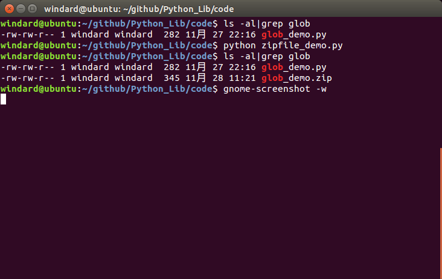

##zipfile

压缩和加压，我们想要实现的功能有这些，压缩某个或多个文件，压缩整个文件夹，解压文件到某个文件夹。      
```python
#coding=utf-8
import zipfile
filename = 'glob_demo.py'
zipname = zipfile.ZipFile('glob_demo.zip','w',zipfile.ZIP_DEFLATED)
zipname.write(filename)
zipname.close()
```
保存为zipfile_demo.py,运行，看一下结果。                  
                          

如果想将整个文件夹压缩进去的话，需要借助os库来实现,我们首先需要得到一个递归的目录结构，然后按着目录结构将其写入。我的这个代码是只能够压缩当前目录且保持目录结构正确的，如果你压缩进去的不是当前目录里的文件的话，它就会将你的目录结构全部保留在压缩包里，所以如果使用我的这个代码压缩文件夹的话，只能使用当前目录下的文件夹。                    
```python
#coding=utf-8
import zipfile
import os
allfile = []
#递归得到所有的文件，空文件夹则忽略不计
def getall(begindir):
	global allfile
	newpath = os.listdir(begindir)
	for i in newpath:
		currentpath = os.path.join(begindir,i)
		if os.path.isdir(currentpath):
			getall(currentpath)
		else:
			allfile.append(currentpath)
#需要压缩的文件夹
getall('test')
f = zipfile.ZipFile('test.zip','w',zipfile.ZIP_DEFLATED)
for i in allfile:
	f.write(i)
f.close()
```
保存为zipfile_dir.py，运行，看一下结果。       
                     


确实是有准确的目录结构的压缩包，接下来就是解压了。                     
```python
#coding=utf-8
import zipfile
#解压文件到当前文件夹
f = zipfile.ZipFile('test.zip','r')
#这一步为了保存压缩文件的目录结构
#此处也可以直接用g.extractall()
for i in f.namelist():
	f.extract(i)
#解压文件到指定文件夹
for i in f.namelist():
	f.extract(i,'demo')
```
保存为zipfile_unzip.py。    